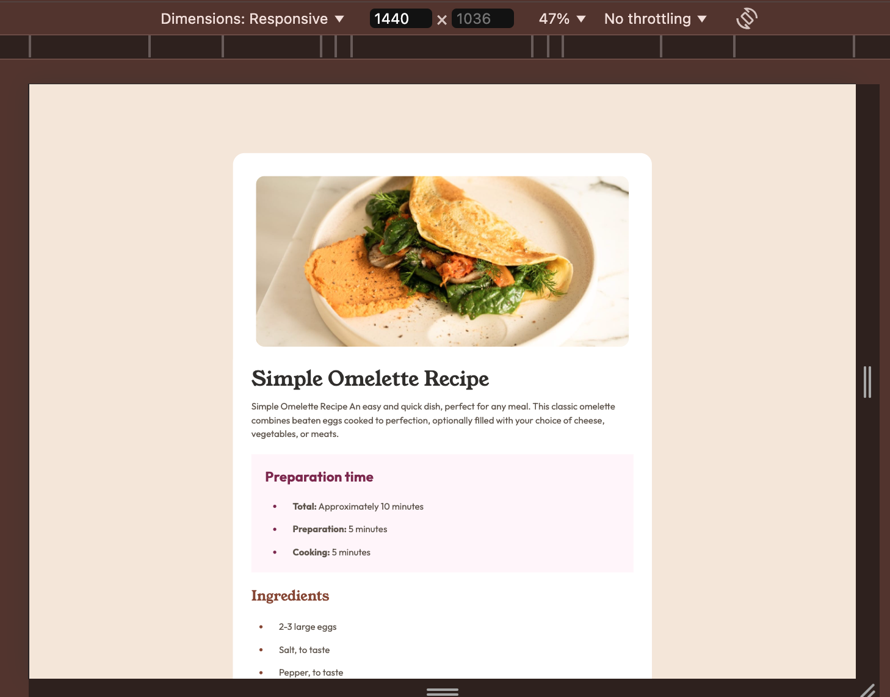
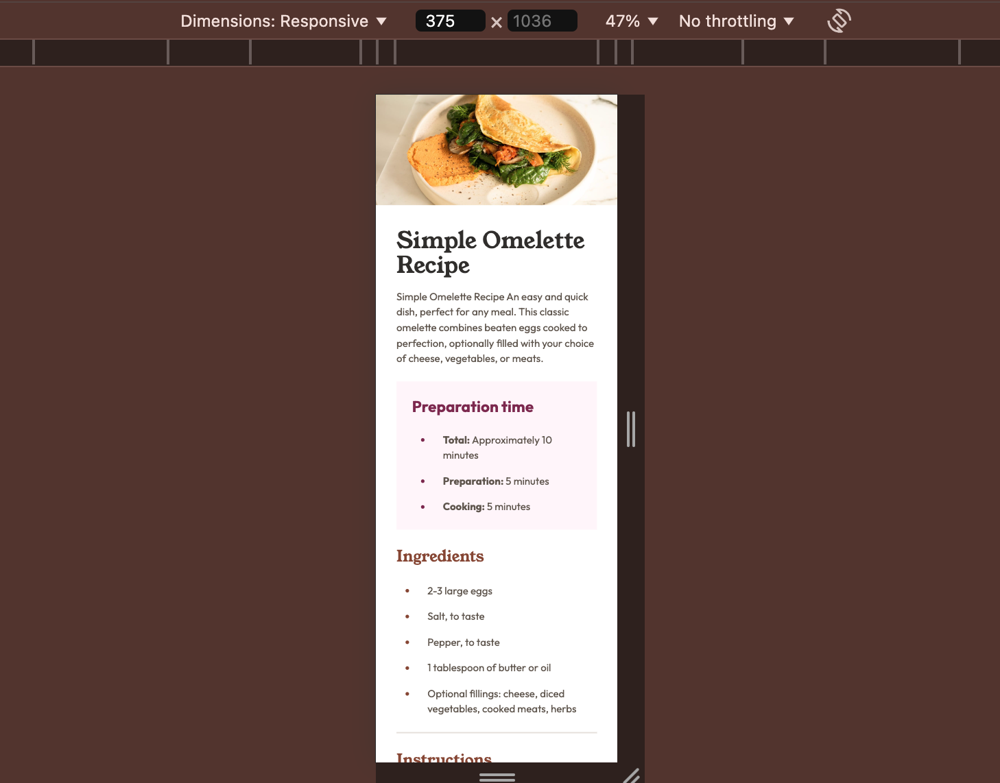

# Frontend Mentor - Recipe page solution

This is a solution to the [Recipe page challenge on Frontend Mentor](https://www.frontendmentor.io/challenges/recipe-page-KiTsR8QQKm). Frontend Mentor challenges help you improve your coding skills by building realistic projects.

## Table of contents

- [The challenge](#the-challenge)
- [Screenshot](#screenshot)
- [Links](#links)
- [Built with](#built-with)

- [Author](#author)

### Screenshot

### Links

- Solution URL: [Github](https://github.com/steffieMD/recipe-page.git)
- Live Site URL: [Netlify](https://a-simple-omelette-recipe-page.netlify.app/)

### Built with

- Semantic HTML5 markup
- CSS custom properties
- Flexbox
- Mobile-first workflow

## Author

- Website - [Stephanie Metieh](https://steff-metieh-portfolio.netlify.app/)
- Frontend Mentor - [@steffieMD](https://www.frontendmentor.io/profile/steffieMD)
